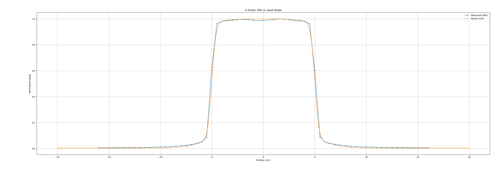
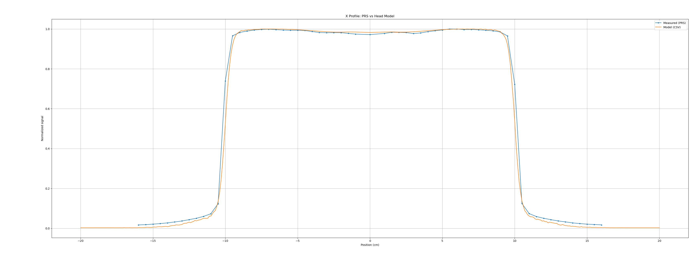

# Head Model – Photon Beam Fluence

## Overview
**Head Model** is a research and educational project aimed at developing a simplified photon beam model (and dose calculation engine) for external beam radiotherapy. The goal is to gradually build a transparent and modular implementation of the main components used in treatment planning system (TPS) dose engines, starting from beam fluence modeling and progressing toward dose calculation in a water phantom.

The project is implemented primarily in **C++**, with a focus on clarity of physics concepts, modular design, and extensibility for future development. It is intended as a learning platform for exploring beam modeling techniques used in modern radiotherapy dose algorithms.

## Objectives
The main objectives of the project are:

- Develop a **dual-source photon beam fluence model** consisting of:
  - a primary photon source representing the target
  - an extra-focal source representing head scatter (e.g. flattening filter scatter)

- Model **jaw transmission and beam collimation** effects.

- Extend the fluence model to calculate **dose in a water phantom**, including:
  - attenuation of primary photons
  - off-axis fluence variation
  - beam softening effects
  - scatter transport in water

- Eventually develop a simplified **collapsed cone convolution (CCC) style dose calculation framework**.

## Current Features
At the current stage, the project includes:

- Dual-source beam fluence model
- Gaussian sampling of source distributions
- Jaw transmission modeling
- DEV-style ray tracing from source to scoring plane
- Separation of primary and extra-focal fluence contributions
- Output of fluence maps and profiles for analysis

## Repository Structure
The code is organized into several modules:

- **geom** – basic geometric structures and vector utilities  
- **grid** – grid and image data structures  
- **source** – photon source sampling models  
- **collimation** – jaw aperture and transmission models  
- **fluence** – beam fluence calculation models  
- **io** – utilities for exporting images and profiles  

## Results (Fluence Validation)

Comparison between:
- **Measured data (Sun Nuclear Profiler)**
- **Head Model output**

### 10 × 10 cm² Field

---

### 20 × 20 cm² Field

---

### Observations
- Good agreement in:
  - field flatness
  - penumbra width
  - shoulder behaviour
- Extra-focal Gaussian successfully reproduces:
  - out-of-field tails
- Off-axis factor improves large-field agreement

## Intended Use
This project is intended for:

- educational exploration of radiotherapy beam modeling
- experimentation with simplified TPS dose algorithms
- development of prototype dose calculation engines

⚠️ **This software is not intended for clinical use.**

## Author
Rohit Inippully
